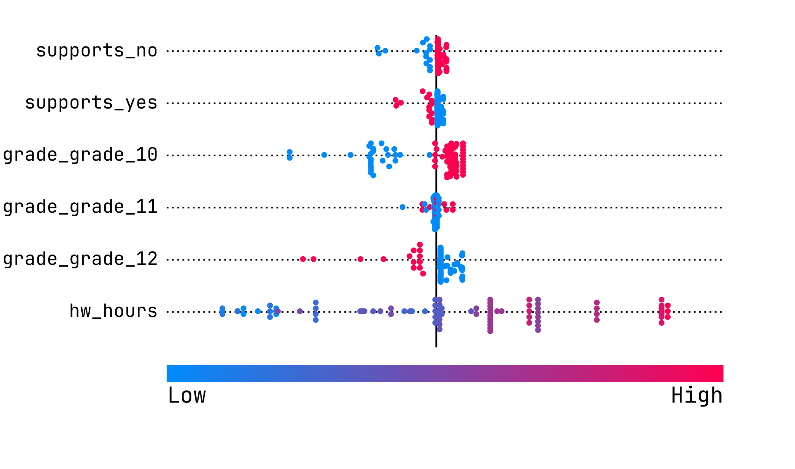

# How to use Beeswarmer
The following is a little manual on how to generate your very own beeswarm plot using your survey data and Beeswarmer.

## Intuition
To gain a full understanding of how to best use a beeswarm plot in your work, you must understand the basic idea behind how they are generated. They are extremely helpful, as they can inform how a dependent variable changes in relation to as many independent variables as are present. However, they do have some drawbacks that can lead to inaccurate conclusions if used incorrectly.

Beeswarmer's beeswarm plots graph what's called Shapley values. The formal definition of the Shapley value for a feature is the average marginal contribution of said feature. Now, what does this mean?

Imagine we have Alice and Bob, who enroll together in a cooking competition. By working together, perhaps they are able to win prize money of \$50. Now, let's go back in time and have just Bob do the competition solo. In this hypothetical, he wins \$20. If we assume that a team is worth the sum of its parts, we can reason that Alice joining Bob's team would bring \$30 extra of prize money. Bob alone wins \$20, Alice alone wins \$30, and their individual contributions add up to \$50.

Of course, there are flaws here. Putting aside that efficiency (assuming that a team is worth exactly the sum of its parts) is often an idealistic assumption to make, maybe this cooking competition in particular specifically suits Alice's skill set. Perhaps we imagine a new team of Richard and Clyde earns \$40 at some cooking competition. If Alice joins them, then they win \$60 at the competition. In this case, Alice only brought \$20 of value by joining the team, unlike earlier.

Alice's Shapley value is what value, on average, she will add to a team by joining it. With this sample size of two, the average value that Alice brings to a team in this case is $25. If we had more data, we could perhaps get a better estimate for what Alice contributes to any given team. If we had yet another team, we could make a decent approximation of how much prize money they would win with Alice joining it simply by adding her Shapley value to the amount the team wins without her.

Neat! How does this apply to survey data?

Well, let's pretend that you've run a survey trying to predict levels of academic stress in students. Perhaps your survey looks like this:
```
1. How many hours of homework do you have each night, on average?
   [Number Entry]
2. Do you feel that there are accurate supports in place for students struggling with coursework?
   - Yes
   - No
3. In which grade are you currently?
   - Grade 10
   - Grade 11
   - Grade 12
4. How would you rate your current stress from school, where 5 is the highest?
   - 1
   - 2
   - 3
   - 4
   - 5
```

In this survey, we will be looking at how the first three questions affect the fourth. One way we could do it is by looking at the contribution a certain answer gives when combined with a coalition of all the others. Sound familiar? Let's look at an example.

Let's say we have the following responses from a survey respondent:
```
1. 1
2. No
3. Grade 11
4. 4
```
And let's say we have another different survey respondent:
```
1. 1
2. No
3. Grade 12
4. 3
```
In these two examples, the first two questions' answers match, but then they differ in the last two questions. The change in grade from 11 to 12 seems to have dropped the stress level by 1 point. If we looked at how this change, on average, affected everything, we can calculate our Shapley values for each survey answer. That is, how much effect, on average, switching to this survey answer will have.

Now, there's still one big problem with this approach. In order to definitively calculate all the contributions, we need isolated examples of just about every possible change that could've happened in our data. Most likely though, we're missing an enormous chunk of it. This is the last component of how Beeswarmer works: machine learning.

Instead of directly trying to compute the Shapley values from the data, Beeswarmer will first use machine learning to generate a predictive model based on your survey data. This means that the data doesn't have to be anywhere near complete to be able to generate a beeswarm plot. That said, the more survey data there is, the better the model will be and the more definitive the conclusions will seem.

Now let's take a look at a Beeswarm plot!

## Reading and Understanding Beeswarm Plots

Here's a beeswarm plot that could reflect the survey from earlier:



Now, this data is fictitious and generated. However, it was biased in order to be able to show how to read these things.

What is graphed here is the contribution for each individual instance. If you were to do a special kind of average with these, you would get the true Shapley value. This means that for this type of analysis, we care a lot more about overall patterns than the individual dots.

To read these, you look at both the position and colour of the dots. The position relates to the effect on the output variable. The further right a point is found on the plot, the higher of a positive effect it has. Likewise, dots that are far to the left have a negative effect on the output. In this case, dots further to the right indicate a higher level of academic stress, and dots far to the left indicate a low level of academic stress. With these, how far out the dots are does make a difference. We can tell that hw_hours is the most important property of this dataset, since it has the most extreme positive and negative effects. Put another way, it is the most closely correlated with the output variable.

Note that the positive direction isn't necessarily the good direction. It just means it has an effect of making the output larger or more likely. In this particular example, a positive effect means more academic stress which most people would consider to be a bad thing.

Now, the colour. This tells you if the entry at that position was high or low. The bar on the bottom states the colour that corresponds to high and low. In this graph, pink means high. A pink value to the right means that when this feature's value is high, it has a positive effect on the output. This is trickier to wrap your head around, so let's see some examples.  

We'll start right at the bottom with the hw_hours (homework hours) row. This row was open to freely enter numbers, so the numbers are ranging all over the place. We can see a lot of pink dots far to the right. This means that when the number of homework hours per night is high, stress tends to be higher as well. The blue dots on the left mean the opposite; little homework per night corresponds to lower academic stress.

This leads us into the **largest issue with beeswarm plots** - they *cannot* be used to establish causation. For that last example, the only thing we know for certain is that more homework per night is correlated with more academic stress. However, we don't know if one causes the other, or even if there's a third factor. Maybe it's true that doing more homework causes you to care more about schoolwork which in turn causes more stress. Maybe instead it's the other way around, where someone being stressed about their courses causes them to do more homework per night. Maybe their parental figures are imposing both more stress and more homework. All of these hypotheses are reasonable, and this type of analysis cannot tell you which one it is. You will need to do a much tighter study and control a lot more variables in order to establish causation.

With that out of the way, we can take a look at the other columns. These aren't numerical; they were instead discrete options and answers. These are put onto the graph using something called one-hot encoding. With one-hot, high values mean the effect when that option is selected, and blue values are when that option isn't selected. Looking at supports_no, we see high values to the right. This means that when "No" was selected for the question about thinking school supports are adequate, there was generally a higher academic stress with the person as opposed to when "No" was not selected.

> **_NOTE:_**  There's another type of encoding called Label encoding that Beeswarmer doesn't really provide tools for. One-hot should work great for most applications, but if you know you need Label, I would recommend either processing your CSV before importing it or doing it manually within Beeswarmer's CSV editing.
> 
Let's look down to the grade columns. We see that if someone is in grade 12, there's a negative effect on the stress. If someone is *not* in grade 12, (i.e. responded with grades 10 or 11), there's a positive effect on the stress. This means that this data suggests that people in grade 12 tend to have lower academic stress than all other respondents.

The last thing of note is the grade 11 row. There's a bit of a pattern to it, but for the most part it seems to be a garbled mess. Whenever you see dots of all colours mixed together without clear separation, this means that there isn't much correlation between this feature and the dependent variable. Often this is due to a lack of data, but sometimes it truly means there is little correlation.

## Step-by-Step Guide

Now that you understand what a beeswarm plot is and how to read one, here's a step-by-step guide on how to use Beeswarmer to generate one.